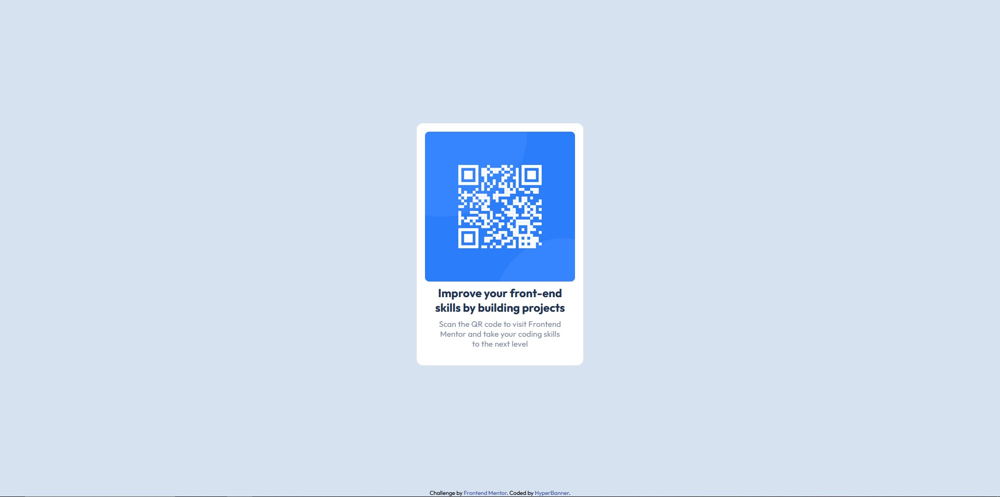

# Frontend Mentor - QR code component solution

This is a solution to the [QR code component challenge on Frontend Mentor](https://www.frontendmentor.io/challenges/qr-code-component-iux_sIO_H). Frontend Mentor challenges help you improve your coding skills by building realistic projects.

## Table of contents

- [Overview](#overview)
  - [Screenshot](#screenshot)
  - [Links](#links)
- [My process](#my-process)
  - [Built with](#built-with)
- [Author](#author)

## Overview

### Screenshot

### Links

- Solution URL: https://www.frontendmentor.io/solutions/qrcodecomponent-using-simple-flexbox-layout-sYoQC30PkK
- Live Site URL: https://hyperbanner.github.io/qr-code-component/

## My process

### Built with

- Flexbox. That's it.

## Author

- GitHub - [HyperBanner](https://github.com/HyperBanner)
